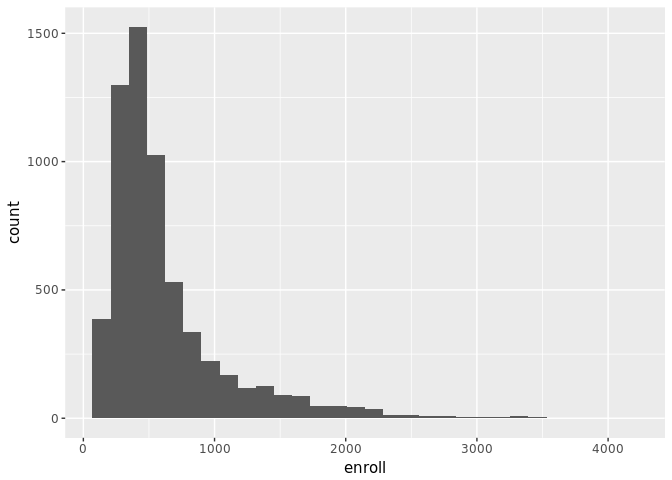
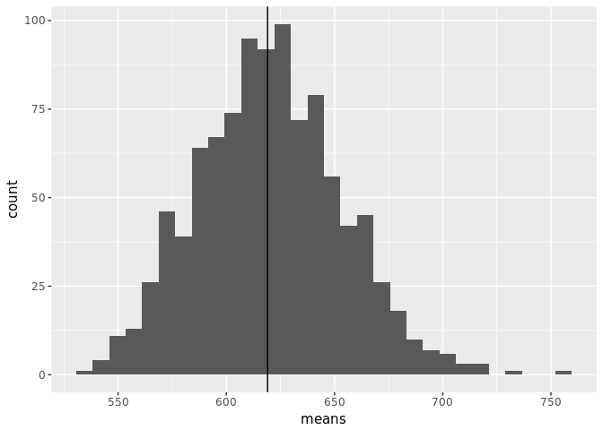

# Chapter 2 Notes
Tim  
11/5/2017  


## Estimation of the mean

\[ \mu_X = \frac{1}{N}\sum_{i=1}^n \hat{X_i}\]

## Estimate total population:

\[\hat{N} = \sum_{i=1}^n \frac{1}{\pi_i}\]

## Surveys in R


```r
library(tidyverse)
library(survey)
data(api)

ggplot(apipop, aes(x=enroll)) +
  geom_histogram()
```

<!-- -->

```r
samples <- 1:1000
schoolpop <- apipop$enroll[complete.cases(apipop$enroll)]

means <- apply(as.array(samples), 1, function(i) mean(sample(x=schoolpop, size = 200, replace = TRUE)))
d <- data.frame( sample = 1:1000)
d$means <- means
ggplot(data=d, aes(x = means)) +
  geom_histogram() + 
  geom_vline(xintercept = mean(schoolpop))
```

<!-- -->

Next, we introduce some `survery` package tools. We create a survey design by looking at a random sample of California schools from the `api` data set. This is the a new perspective on the data above, estimated total population and mean from the random sample, based on a random sample of 200.


```r
srs_design <- svydesign(id=~1, fpc=~fpc, data=apisrs)
srs_design
```

```
## Independent Sampling design
## svydesign(id = ~1, fpc = ~fpc, data = apisrs)
```


```r
svytotal(~enroll, srs_design)
```

```
##          total     SE
## enroll 3621074 169520
```


```r
svymean(~enroll, srs_design)
```

```
##          mean     SE
## enroll 584.61 27.368
```

And here is the actual population and mean:


```r
sum(schoolpop)
```

```
## [1] 3811472
```

```r
mean(schoolpop)
```

```
## [1] 619.0469
```

Some extra details in the data. `pw` is the sampling weight and `fpc` is the finite population correction:


```r
unique(apisrs$pw)
```

```
## [1] 30.97
```

```r
unique(apisrs$fpc)
```

```
## [1] 6194
```

Where the sampling weight is 6194/200 = 30.97. As discussed in the text, with large samples, usually the case with complex surveys, the finite population correction `fpc` is very small. Here's an example:


```r
nofpc <- svydesign(id=~1, weights=~pw, data=apisrs)
svytotal(~enroll, nofpc)
```

```
##          total     SE
## enroll 3621074 172325
```

```r
svymean(~enroll, nofpc)
```

```
##          mean     SE
## enroll 584.61 27.821
```

We only see a small increase in the standard error. 

On categorical type variables:


```r
svytotal(~stype, srs_design)
```

```
##          total     SE
## stypeE 4397.74 196.00
## stypeH  774.25 142.85
## stypeM 1022.01 160.33
```

gives the estimated total population for elementary, middle, and high schools.

We can also call multiple variables to estimate, and use contrasts to make combinations:


```r
(means <- svymean(~api00+api99, srs_design))
```

```
##         mean     SE
## api00 656.58 9.2497
## api99 624.68 9.5003
```

```r
svycontrast(means, c(api00=1, api99=-1))
```

```
##          contrast     SE
## contrast     31.9 2.0905
```

```r
svycontrast(means, quote(api00-api99))
```

```
##          nlcon     SE
## contrast  31.9 2.0905
```

Add variables with `update`:


```r
srs_design <- update(srs_design, apidiff=api00-api99)
svymean(~apidiff, srs_design)
```

```
##         mean     SE
## apidiff 31.9 2.0905
```


## Stratified Sampling

The principle idea is to divide the population into groups called strata, with a separate probability sample from each one. Importantly, "a stratified sample is just a set of simple random samples from each stratum."

Let's take a look at a Stratified example that takes 100 elementary schools, 50 middle schools, and 50 high schools. Since high schools are the largest, a total random sample will include more high schools. The idea is to decrease the variance in groups with a smaller number. 


```r
strat_design <- svydesign(id=~1, strata = ~stype, fpc=~fpc, data=apistrat)
svytotal(~enroll, strat_design)
```

```
##          total     SE
## enroll 3687178 114642
```

```r
svymean(~enroll, strat_design)
```

```
##          mean     SE
## enroll 595.28 18.509
```

The estimates have increased, meaning they are closer to the true values of 619.0469384 and 3811472.

It is important to note a change in `fpc`:


```r
unique(apistrat$fpc)
```

```
## [1] 4421 1018  755
```

The `fpc` corresponds to the total number of schools in each strata. Good quote from the book: "This extra information on the population is the source of the extra precision in the estimates, and the precision increase is greatest for the variables that are most accurately predicted by the population information."

For example, 

```r
svymean(~api00+api99, strat_design)
```

```
##         mean     SE
## api00 662.29 9.4089
## api99 629.39 9.9639
```

```r
svytotal(~stype, strat_design)
```

```
##        total SE
## stypeE  4421  0
## stypeH   755  0
## stypeM  1018  0
```

`api` scores haven't improved much, since the breakdown by schools doesn't provide much more information. However now the population total is exact, since we specify the population of each subgroup.

## Replicate Weights

Replicate Weights are various methods used to calculate the standard error of a statistic, usually the ones besides total and mean.

Replicate weights compute the standard deviation across partially independent samples, and extrapolates this to the standard deviation between completely independent samples. 


```r
library(foreign)
chis_adult <- read.dta('Adult.dta')
```

If the survey specifies replicate weights directly, we can use those directly:


```r
chis <- svrepdesign(variables=chis_adult[,1:418],
                    repweights = chis_adult[,420:499],
                    weights=chis_adult[,419], combined.weights=TRUE,
                    type="other", scale=1, rscales=1)
```

If not given replicate weighs, we can create them:


```r
boot_design <- as.svrepdesign(strat_design, type="bootstrap", replicates=100)
jk_design <- as.svrepdesign(strat_design)

svymean(~enroll, boot_design)
```

```
##          mean     SE
## enroll 595.28 16.757
```

```r
svymean(~enroll, jk_design)
```

```
##          mean     SE
## enroll 595.28 18.509
```

## Estimating subpopulations

Since each stratum is a random sample, to estimate statistics for that population we can only use the data from that state.

However, we are often concerned about other populations within the survey that do not make a stratum. For example, the 18-25 year old age group in BRFSS is not a stratum, meaning that the pairwise sampling probabilities are not necessarily non-zero, "because the number of participants from this age group is random rather than fixed in advance."

Here, "Since the sampling weights would be correct but the pairwise sampling probability would be incorrect, the resulting point estimates would be right, but the standard errors would be wrong."

Consider the `emer` variable in `api`:


```r
str(apipop$emer)
```

```
##  int [1:6194] 16 10 12 4 5 5 0 11 16 0 ...
```

This is the proportion of teachers in the school with emergency teaching credentials. We can estimate the mean academic performance index of schools with varying needs for teachers:


```r
emerg_high <- subset(strat_design, emer>20)
emerg_low <- subset(strat_design, emer==0)

svymean(~api00+api99, emerg_high)
```

```
##         mean     SE
## api00 558.52 21.708
## api99 523.99 21.584
```

```r
svymean(~api00+api99, emerg_low)
```

```
##         mean     SE
## api00 749.09 17.516
## api99 720.07 19.061
```

```r
svytotal(~enroll, emerg_high)
```

```
##         total     SE
## enroll 762132 128674
```

```r
svytotal(~enroll, emerg_low)
```

```
##         total    SE
## enroll 461690 75813
```

Unsurprisingly, schools with no emergency teachers tend to do much better on average based on `api` scores. Unfortunately there are many more schools that have greater than 20% emergency teachers. 

With the CHIS data, we can estimate BMI means for race and sex subgroups:


```r
svyby(~bmi_p, ~srsex+racehpr, svymean, design=chis, keep.names = FALSE)
```

```
##     srsex                        racehpr    bmi_p         se
## 1    MALE                         LATINO 28.18783 0.14474308
## 2  FEMALE                         LATINO 27.47816 0.14430645
## 3    MALE               PACIFIC ISLANDER 29.67772 0.70546474
## 4  FEMALE               PACIFIC ISLANDER 27.80858 0.97463312
## 5    MALE AMERICAN INDIAN/ALASKAN NATIVE 28.76034 0.54607014
## 6  FEMALE AMERICAN INDIAN/ALASKAN NATIVE 26.95611 0.42119680
## 7    MALE                          ASIAN 24.91641 0.14058629
## 8  FEMALE                          ASIAN 22.98878 0.11123450
## 9    MALE               AFRICAN AMERICAN 28.01857 0.26630600
## 10 FEMALE               AFRICAN AMERICAN 28.37741 0.24170486
## 11   MALE                          WHITE 26.99603 0.05977747
## 12 FEMALE                          WHITE 25.59549 0.06798635
## 13   MALE     OTHER SINGLE/MULTIPLE RACE 26.93328 0.37419059
## 14 FEMALE     OTHER SINGLE/MULTIPLE RACE 26.74352 0.31577260
```

Or by median, with a demonstration of ratios:


```r
medians <- svyby(~bmi_p, ~srsex+racehpr, svyquantile, design=chis, covmat=TRUE, 
      quantiles=0.5)
svycontrast(medians, quote(MALE.LATINO/FEMALE.LATINO))
```

```
##           nlcon     SE
## contrast 1.0449 0.0151
```

## Exercises

#### 2.3 

We can compute all the cross-tabulations with by using `interaction`:

```r
ftable(svytotal(~interaction(ab29,ab30), chis)) %>%
  as.tibble() %>%
  spread(Var2, n) %>%
  filter(A!=0)
```

```
## # A tibble: 3 x 3
##                                     Var1        A        B
##                                    <chr>    <dbl>    <dbl>
## 1 interaction(ab29, ab30)NO.INAPPLICABLE 19833060 68902.10
## 2          interaction(ab29, ab30)YES.NO  2076711 52088.12
## 3         interaction(ab29, ab30)YES.YES  4477843 53271.47
```

```r
totals <- svyby(~interaction(ab29,ab30), ~racehpr+ins+marit, 
      svytotal, design=chis, keep.names=FALSE) 
totals %>%
  as.tibble() %>%
  select(racehpr, ins, marit, yes_yes = `interaction(ab29, ab30)YES.YES`)
```

```
## # A tibble: 42 x 4
##                           racehpr    ins   marit yes_yes
##  *                         <fctr> <fctr>  <fctr>   <dbl>
##  1                         LATINO    YES MARRIED  360165
##  2               PACIFIC ISLANDER    YES MARRIED   14391
##  3 AMERICAN INDIAN/ALASKAN NATIVE    YES MARRIED   23454
##  4                          ASIAN    YES MARRIED  362872
##  5               AFRICAN AMERICAN    YES MARRIED  139975
##  6                          WHITE    YES MARRIED 1509984
##  7     OTHER SINGLE/MULTIPLE RACE    YES MARRIED   59286
##  8                         LATINO     NO MARRIED   30241
##  9               PACIFIC ISLANDER     NO MARRIED       0
## 10 AMERICAN INDIAN/ALASKAN NATIVE     NO MARRIED    3518
## # ... with 32 more rows
```

Alternatively, we can directly specify the response which makes some things easier like rations. The output is also requires less tidying.


```r
svytotal(~I((ab29=='YES')*(ab30=='YES')), chis)
```

```
##                                        total    SE
## I((ab29 == "YES") * (ab30 == "YES")) 4477843 53271
```

```r
svytotal(~ab29+ab30, chis)
```

```
##                        total    SE
## ab29NOT ASCERTAINED        0     0
## ab29DON'T KNOW             0     0
## ab29REFUSED                0     0
## ab29PROXY SKIPPED          0     0
## ab29INAPPLICABLE           0     0
## ab29YES              6554554 68771
## ab29NO              19833060 68902
## ab30NOT ASCERTAINED        0     0
## ab30DON'T KNOW             0     0
## ab30REFUSED                0     0
## ab30PROXY SKIPPED          0     0
## ab30INAPPLICABLE    19833060 68902
## ab30YES              4477843 53271
## ab30NO               2076711 52088
```

Using this syntax it is easy to specify ratios:


```r
# ratio of treated to total cases
svyratio(~(ab30=="YES"), ~(ab29=="YES"), chis)
```

```
## Ratio estimator: svyratio.svyrep.design(~(ab30 == "YES"), ~(ab29 == "YES"), chis)
## Ratios=
##               ab29 == "YES"
## ab30 == "YES"     0.6831652
## SEs=
##             [,1]
## [1,] 0.006345503
```

```r
svyby(~(ab30=="YES"), by=~ins,
      denominator=~(ab29=='YES'), design=chis, svyratio)
```

```
##     ins ab30 == "YES"/ab29 == "YES" se.ab30 == "YES"/ab29 == "YES"
## YES YES                   0.7169276                    0.006681865
## NO   NO                   0.3353027                    0.021403819
```

70% of people with insurance have treated hypertension, compared to only 30% of people without insurance.


```r
svyby(~(ab30=="YES"), by=~racehpr,
      denominator=~(ab29=='YES'), design=chis, svyratio)
```

```
##                                                       racehpr
## LATINO                                                 LATINO
## PACIFIC ISLANDER                             PACIFIC ISLANDER
## AMERICAN INDIAN/ALASKAN NATIVE AMERICAN INDIAN/ALASKAN NATIVE
## ASIAN                                                   ASIAN
## AFRICAN AMERICAN                             AFRICAN AMERICAN
## WHITE                                                   WHITE
## OTHER SINGLE/MULTIPLE RACE         OTHER SINGLE/MULTIPLE RACE
##                                ab30 == "YES"/ab29 == "YES"
## LATINO                                           0.5408639
## PACIFIC ISLANDER                                 0.6306582
## AMERICAN INDIAN/ALASKAN NATIVE                   0.6945136
## ASIAN                                            0.7525662
## AFRICAN AMERICAN                                 0.7195543
## WHITE                                            0.7127307
## OTHER SINGLE/MULTIPLE RACE                       0.6144020
##                                se.ab30 == "YES"/ab29 == "YES"
## LATINO                                            0.019018347
## PACIFIC ISLANDER                                  0.123576228
## AMERICAN INDIAN/ALASKAN NATIVE                    0.046868414
## ASIAN                                             0.020756613
## AFRICAN AMERICAN                                  0.024371730
## WHITE                                             0.006846281
## OTHER SINGLE/MULTIPLE RACE                        0.044118509
```

```r
svyby(~(ab30=="YES"), by=~marit+ins,
      denominator=~(ab29=='YES'), design=chis, svyratio)
```

```
##                                                                   marit
## MARRIED.YES                                                     MARRIED
## OTHERWID/SEP/DIV/LIVING W/PARTNER.YES OTHERWID/SEP/DIV/LIVING W/PARTNER
## NEVER MARRIED.YES                                         NEVER MARRIED
## MARRIED.NO                                                      MARRIED
## OTHERWID/SEP/DIV/LIVING W/PARTNER.NO  OTHERWID/SEP/DIV/LIVING W/PARTNER
## NEVER MARRIED.NO                                          NEVER MARRIED
##                                       ins ab30 == "YES"/ab29 == "YES"
## MARRIED.YES                           YES                   0.7200304
## OTHERWID/SEP/DIV/LIVING W/PARTNER.YES YES                   0.7656414
## NEVER MARRIED.YES                     YES                   0.5349298
## MARRIED.NO                             NO                   0.3772597
## OTHERWID/SEP/DIV/LIVING W/PARTNER.NO   NO                   0.3443324
## NEVER MARRIED.NO                       NO                   0.2367309
##                                       se.ab30 == "YES"/ab29 == "YES"
## MARRIED.YES                                              0.008684955
## OTHERWID/SEP/DIV/LIVING W/PARTNER.YES                    0.009500674
## NEVER MARRIED.YES                                        0.019029383
## MARRIED.NO                                               0.036120305
## OTHERWID/SEP/DIV/LIVING W/PARTNER.NO                     0.028997329
## NEVER MARRIED.NO                                         0.041932375
```

```r
svyby(~(ab30=="YES"), by=~racehpr+ins,
      denominator=~(ab29=='YES'), design=chis, svyratio)
```

```
##                                                           racehpr ins
## LATINO.YES                                                 LATINO YES
## PACIFIC ISLANDER.YES                             PACIFIC ISLANDER YES
## AMERICAN INDIAN/ALASKAN NATIVE.YES AMERICAN INDIAN/ALASKAN NATIVE YES
## ASIAN.YES                                                   ASIAN YES
## AFRICAN AMERICAN.YES                             AFRICAN AMERICAN YES
## WHITE.YES                                                   WHITE YES
## OTHER SINGLE/MULTIPLE RACE.YES         OTHER SINGLE/MULTIPLE RACE YES
## LATINO.NO                                                  LATINO  NO
## PACIFIC ISLANDER.NO                              PACIFIC ISLANDER  NO
## AMERICAN INDIAN/ALASKAN NATIVE.NO  AMERICAN INDIAN/ALASKAN NATIVE  NO
## ASIAN.NO                                                    ASIAN  NO
## AFRICAN AMERICAN.NO                              AFRICAN AMERICAN  NO
## WHITE.NO                                                    WHITE  NO
## OTHER SINGLE/MULTIPLE RACE.NO          OTHER SINGLE/MULTIPLE RACE  NO
##                                    ab30 == "YES"/ab29 == "YES"
## LATINO.YES                                           0.6141168
## PACIFIC ISLANDER.YES                                 0.6644577
## AMERICAN INDIAN/ALASKAN NATIVE.YES                   0.6996284
## ASIAN.YES                                            0.7635967
## AFRICAN AMERICAN.YES                                 0.7534946
## WHITE.YES                                            0.7346075
## OTHER SINGLE/MULTIPLE RACE.YES                       0.6451303
## LATINO.NO                                            0.2452381
## PACIFIC ISLANDER.NO                                  0.0000000
## AMERICAN INDIAN/ALASKAN NATIVE.NO                    0.6622234
## ASIAN.NO                                             0.6426947
## AFRICAN AMERICAN.NO                                  0.3684644
## WHITE.NO                                             0.3205181
## OTHER SINGLE/MULTIPLE RACE.NO                        0.2644928
##                                    se.ab30 == "YES"/ab29 == "YES"
## LATINO.YES                                            0.021400543
## PACIFIC ISLANDER.YES                                  0.123281997
## AMERICAN INDIAN/ALASKAN NATIVE.YES                    0.052311804
## ASIAN.YES                                             0.019930116
## AFRICAN AMERICAN.YES                                  0.025121751
## WHITE.YES                                             0.006745346
## OTHER SINGLE/MULTIPLE RACE.YES                        0.047458751
## LATINO.NO                                             0.038994671
## PACIFIC ISLANDER.NO                                   0.000000000
## AMERICAN INDIAN/ALASKAN NATIVE.NO                     0.114292791
## ASIAN.NO                                              0.067916366
## AFRICAN AMERICAN.NO                                   0.077498074
## WHITE.NO                                              0.031246986
## OTHER SINGLE/MULTIPLE RACE.NO                         0.134860753
```

Error: All replicates contained NAs. This means we don't have the data to fully estimate the subgroups broken down by race, insurance, and marriage. 


```r
# svyby(~(ab30=="YES"), by=~racehpr+ins+marit,
#       denominator=~(ab29=='YES'), design=chis, svyratio)
```

#### 2.4

We already did the first question in the previous exercise:


```r
# ratio of treated to total cases
svyratio(~(ab30=="YES"), ~(ab29=="YES"), chis)
```

```
## Ratio estimator: svyratio.svyrep.design(~(ab30 == "YES"), ~(ab29 == "YES"), chis)
## Ratios=
##               ab29 == "YES"
## ab30 == "YES"     0.6831652
## SEs=
##             [,1]
## [1,] 0.006345503
```

Next, we want the proportion of diabetics `ab22` with diagnosed hypertension:


```r
svyratio(~(ab22=='YES'), ~(ab29=='YES'), chis)
```

```
## Ratio estimator: svyratio.svyrep.design(~(ab22 == "YES"), ~(ab29 == "YES"), chis)
## Ratios=
##               ab29 == "YES"
## ab22 == "YES"     0.2798958
## SEs=
##             [,1]
## [1,] 0.006410234
```

And the proportion of hypertensive diabetics whose diabetes is being treated. The book say the variable for the treatment of diabetics, so I'll modify the question and consider the hypertensive diabetics whose hypertension is being treated:


```r
svyby(~(ab30=="YES"), by=~ab22,
      denominator=~(ab29=='YES'), design=chis, svyratio)
```

```
##                                                  ab22
## YES                                               YES
## NO                                                 NO
## BORDERLINE OR PRE-DIABETES BORDERLINE OR PRE-DIABETES
##                            ab30 == "YES"/ab29 == "YES"
## YES                                          0.8767127
## NO                                           0.6405851
## BORDERLINE OR PRE-DIABETES                   0.7171401
##                            se.ab30 == "YES"/ab29 == "YES"
## YES                                           0.011681167
## NO                                            0.007060967
## BORDERLINE OR PRE-DIABETES                    0.040060772
```

Given that some one has hypertension, they are more likely to receive treatment if they also have diabetes. 

#### 2.5


