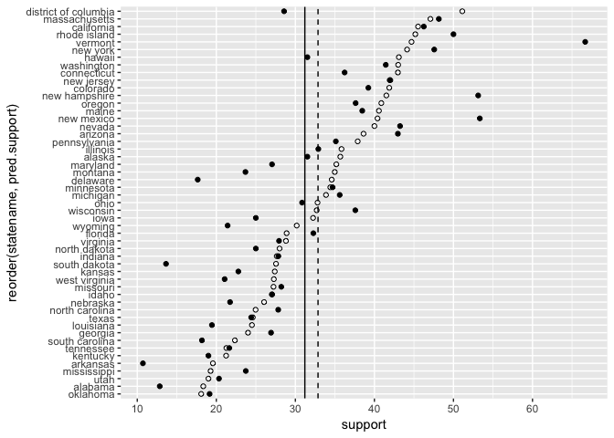
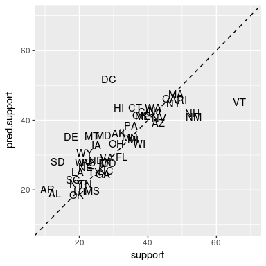
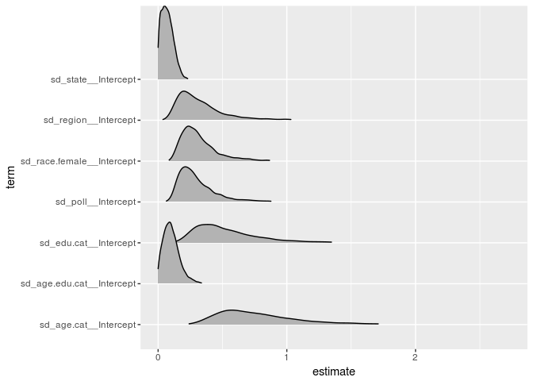
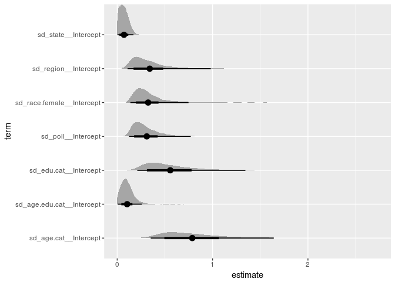
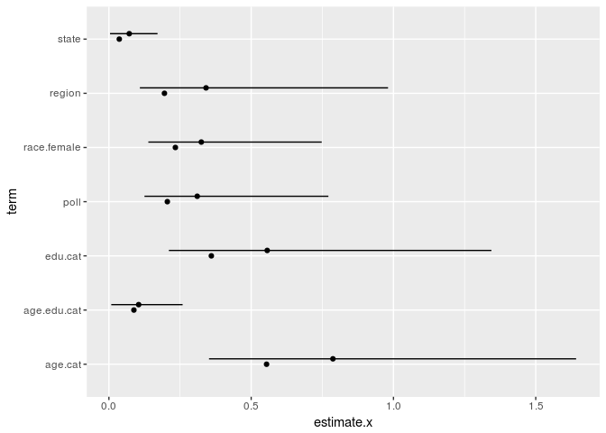

# MRP Primer
Tim  
11/9/2017  


## Data and references

I'll be working through Kastellec et al's MRP primer. The paper and datasets are hosted [at his website](http://www.princeton.edu/~jkastell/mrp_primer.html). 

I have a few goals in this exercise:

1. Verify Kastellec's findings.

2. Attempt a full Bayesian modeling uses `Stan` and `brms`. 

3. Compare

    a. multilevel vs. fixed effects models

    b. results before and after poststratification
  

## Reproduce and Verify

Our goal is to estimate public opinion on gay marriage using this poll:


```r
library(tidyverse)
library(arm)
marriage.data <- foreign::read.dta('gay_marriage_megapoll.dta', convert.underscore=TRUE)
marriage.data %>% as.tibble()
```

```
## # A tibble: 6,548 x 27
##             poll poll.firm poll.year    id statenum     statename
##  *         <chr>     <chr>     <int> <int>    <int>        <fctr>
##  1 Gall2005Aug22      Gall      2005 80001       21      michigan
##  2 Gall2005Aug22      Gall      2005 80002       10       georgia
##  3 Gall2005Aug22      Gall      2005 80003       31      new york
##  4 Gall2005Aug22      Gall      2005 80004       28 new hampshire
##  5 Gall2005Aug22      Gall      2005 80005       42         texas
##  6 Gall2005Aug22      Gall      2005 80006       12      illinois
##  7 Gall2005Aug22      Gall      2005 80007       48     wisconsin
##  8 Gall2005Aug22      Gall      2005 80008       42         texas
##  9 Gall2005Aug22      Gall      2005 80009       41     tennessee
## 10 Gall2005Aug22      Gall      2005 80010       48     wisconsin
## # ... with 6,538 more rows, and 21 more variables: region.cat <int>,
## #   female <int>, race.wbh <int>, edu.cat <int>, age.cat <int>,
## #   age.cat6 <int>, age.edu.cat6 <int>, educ <int>, age <int>,
## #   democrat <int>, republican <int>, black <int>, hispanic <int>,
## #   weight <dbl>, yes.of.opinion.holders <int>, yes.of.all <int>,
## #   state <chr>, state.initnum <int>, region <chr>, no.of.all <dbl>,
## #   no.of.opinion.holders <dbl>
```

## Disaggregration 

The simplest way to gauge politic opinion is to disintegrate the data. Break down the national survey into states and calculate the percentage saying `yes.of.all`. That calculation is very simple with `dplyr`:


```r
marriage.opinion <- marriage.data %>%
  group_by(statename) %>%
  summarise(support = mean(yes.of.all))
marriage.opinion
```

```
## # A tibble: 50 x 2
##               statename   support
##                  <fctr>     <dbl>
##  1              alabama 0.1284404
##  2              arizona 0.4296875
##  3             arkansas 0.1071429
##  4           california 0.4624809
##  5             colorado 0.3923077
##  6          connecticut 0.3623188
##  7             delaware 0.1764706
##  8 district of columbia 0.2857143
##  9              florida 0.3227666
## 10              georgia 0.2692308
## # ... with 40 more rows
```

Let's map it. First we setup our mapping tools.


```r
library(maps)
library(mapdata)
library(ggmap)
states <- map_data("state")

ditch_the_axes <- theme(
  axis.text = element_blank(),
  axis.line = element_blank(),
  axis.ticks = element_blank(),
  panel.border = element_blank(),
  panel.grid = element_blank(),
  axis.title = element_blank()
  )
```

Next, we need to combine our state level data with the national map `states`.


```r
state_opinion <- states %>%
  inner_join(marriage.opinion, by=c('region' = 'statename')) %>% 
  as.tibble()

ggplot(data=state_opinion, aes(x = long, y = lat, group = group)) +
  geom_polygon(aes(fill = support), color = "black") +
  coord_fixed(1.3) + 
  theme_bw() +
  ditch_the_axes + 
  scale_fill_gradient2(low = 'red', mid = 'white', high = 'blue',
                       midpoint = 0.5)
```

<!-- -->

White indicates majority support, with colors trending towards blue indicate increased support. Red colors are states below majority support. Another useful way to look at the map is to the set the color midpoint at the mean 0.3026129.

Alternatively, we can look at an graph sorted by the level of support. Providing an alternative to maps is recommended by Gelman. 


```r
marriage.opinion %>% na.omit() %>%
  ggplot(aes(x=support, y=reorder(statename, support))) +
  geom_point() + 
  geom_vline(xintercept = mean(marriage.opinion$support), linetype=2)
```

<!-- -->

### Additional Mapping Techniques

The previous map was fairly simple and uses the basic tools, but there isn't a nice way to show Alaska and Hawaii. He's how to do it with another package `alberusa`:


```r
library(albersusa)
us <- usa_composite()
us_map <- fortify(us, region="name")

us_map <- us_map %>%
  mutate(id = stringr::str_to_lower(id))

m.s <- mean(marriage.opinion$support)
marriage.opinion[nrow(marriage.opinion) + 1,] <- list("alaska", m.s)
marriage.opinion[nrow(marriage.opinion) + 1,] <- list("hawaii", m.s)

marriage.opinion <- marriage.opinion %>%
  semi_join(us_map, by= c("statename" = "id"))

library(ggthemes)
ggplot() +
  geom_map(data=us_map, map=us_map,
           aes(x=long, y=lat, map_id=id),
           color="#2b2b2b", size=0.1, fill=NA) +
  geom_map(data=marriage.opinion, map=us_map,
           aes(fill=support, map_id=statename),
           color="#2b2b2b", size=0.1) + #change color for borders
  coord_map("polyconic") + 
  scale_fill_gradient2(low='red', mid='white', high='blue', midpoint=0.5) + 
  theme_map() + 
  theme(legend.position="top", 
        legend.key.width=unit(3, "lines")) 
```

<!-- -->

I think this map looks way better and has a more consistent map building syntax.

## Combining Data

Likewise, we may want to use other state level predictors from other sources:


```r
Statelevel <- foreign::read.dta("state_level_update.dta",convert.underscore = TRUE)
Statelevel <- Statelevel[order(Statelevel$sstate.initnum),]
Statelevel %>% as.tibble()
```

```
## # A tibble: 51 x 44
##    sstate.initnum sstate  sstatename ideology professional.index
##  *          <int>  <chr>       <chr>    <dbl>              <dbl>
##  1              1     AK      Alaska       NA              0.227
##  2              2     AL     Alabama    -23.1              0.071
##  3              3     AR    Arkansas    -18.3              0.106
##  4              4     AZ     Arizona    -18.2              0.232
##  5              5     CA  California     -6.2              0.626
##  6              6     CO    Colorado     -8.6              0.202
##  7              7     CT Connecticut     -4.4              0.190
##  8              8     DC        D.C.       NA                 NA
##  9              9     DE    Delaware    -12.2              0.148
## 10             10     FL     Florida    -17.1              0.223
## # ... with 41 more rows, and 39 more variables: professional.cat <int>,
## #   salary <dbl>, totalday <dbl>, staffper <dbl>, citizen.init <int>,
## #   year.adoption <int>, consitutional.init <int>, signature <int>,
## #   usage <int>, legislative.insulation <int>, p.evang <dbl>,
## #   p.mormon <dbl>, p.cath <dbl>, p.metroarea <dbl>, adjinc.cap <dbl>,
## #   pblack <dbl>, phisp <dbl>, p65over <dbl>, phighsch <dbl>,
## #   pbachelors <dbl>, demcontrol <int>, pdemocrat <dbl>,
## #   polarization <dbl>, divided <dbl>, kerry.04 <dbl>, gore.00 <dbl>,
## #   clinton.92 <dbl>, mondale.84 <dbl>, dukakis.88 <dbl>,
## #   humphrey.68 <dbl>, mcgovern.72 <dbl>, population <int>,
## #   court.type <chr>, court.elected <int>, berry.citizen <dbl>,
## #   berry.government <dbl>, Bryan.1896 <dbl>, tempculture <chr>,
## #   state.culture <chr>
```

Finally, we need to load in the US census for poststratification:


```r
Census <- foreign::read.dta("poststratification 2000.dta",convert.underscore = TRUE)
Census <- Census[order(Census$cstate),]
Census$cstate.initnum <-  match(Census$cstate, Statelevel$sstate)
Census %>% as.tibble()
```

```
## # A tibble: 4,896 x 10
##    crace.WBH cage.cat cedu.cat cfemale cstate .freq cfreq.state
##  *     <int>    <int>    <int>   <int>  <chr> <int>       <dbl>
##  1         1        1        1       0     AK   467       21222
##  2         1        2        1       0     AK   377       21222
##  3         1        3        1       0     AK   419       21222
##  4         1        4        1       0     AK   343       21222
##  5         1        1        2       0     AK   958       21222
##  6         1        2        2       0     AK  1359       21222
##  7         1        3        2       0     AK  1000       21222
##  8         1        4        2       0     AK   211       21222
##  9         1        1        3       0     AK   718       21222
## 10         1        2        3       0     AK  1219       21222
## # ... with 4,886 more rows, and 3 more variables: cpercent.state <dbl>,
## #   cregion <chr>, cstate.initnum <int>
```

An important warning with poststratification techniques is that you need demographic information for every intersection of your model predictors. For example, if your model predicts opinion based on gender, race, age, and education you will need to know the number of African American females aged 18 to 29 years old who are college graduates. Do we have that information?


```r
Census %>%
  group_by(crace.WBH, cage.cat, cedu.cat, cfemale) %>%
  summarise(count = sum(.freq)) %>%
  filter(crace.WBH==2, cfemale==1, cage.cat==1)
```

```
## # A tibble: 4 x 5
## # Groups:   crace.WBH, cage.cat, cedu.cat [4]
##   crace.WBH cage.cat cedu.cat cfemale count
##       <int>    <int>    <int>   <int> <int>
## 1         2        1        1       1 31516
## 2         2        1        2       1 42996
## 3         2        1        3       1 50071
## 4         2        1        4       1 13421
```

Next, we need to create a list of indicator variables to poststratify the survey. First, on the mega-poll level, we recode some of the indicator variables and bring some data in from the State level statistics.


```r
# from 1 for white males to 6 for hispanic females
marriage.data$race.female <- (marriage.data$female *3) + marriage.data$race.wbh

# from 1 for 18-29 with low edu to 16 for 65+ with high edu
marriage.data$age.edu.cat <- 4 * (marriage.data$age.cat -1) + marriage.data$edu.cat

# proportion of evangelicals in respondent's state
marriage.data$p.evang.full <- Statelevel$p.evang[marriage.data$state.initnum]

# proportion of mormon's in respondent's state
marriage.data$p.mormon.full <-Statelevel$p.mormon[marriage.data$state.initnum]

# combined evangelical + mormom proportions
marriage.data$p.relig.full <- marriage.data$p.evang.full + marriage.data$p.mormon.full

# kerry's % of 2-party vote in respondent's state in 2004
marriage.data$p.kerry.full <- Statelevel$kerry.04[marriage.data$state.initnum]
```

As an aside, I really dislike this coding scheme as it seems to make the interpretation of the categorical quantities very difficult to understand. I'd like to try an alternative reformulation of the indicators later, or have a function to convert them a la `tidybayes` to easily understand. 

Next, we code the system census in the same way.


```r
Census$crace.female <- (Census$cfemale *3) + Census$crace.WBH 
Census$cage.edu.cat <- 4 * (Census$cage.cat -1) + Census$cedu.cat 
Census$cp.evang.full<-  Statelevel$p.evang[Census$cstate.initnum]
Census$cp.mormon.full <- Statelevel$p.mormon[Census$cstate.initnum]
Census$cp.relig.full <- Census$cp.evang.full + Census$cp.mormon.full
Census$cp.kerry.full <-  Statelevel$kerry.04[Census$cstate.initnum]
```

## Fitting a regression

We'll start with fitting the multilevel model specified in the paper. 


```r
individual.model <- glmer(formula = yes.of.all ~ 
                            (1|race.female) + (1|age.cat) +
                            (1|edu.cat) + (1|age.edu.cat) + 
                            (1|state) + (1|region) + (1|poll) +
                            p.relig.full + p.kerry.full, 
                          data=marriage.data, family=binomial(link="logit"))
```

```r
display(individual.model)
```

```
## glmer(formula = yes.of.all ~ (1 | race.female) + (1 | age.cat) + 
##     (1 | edu.cat) + (1 | age.edu.cat) + (1 | state) + (1 | region) + 
##     (1 | poll) + p.relig.full + p.kerry.full, data = marriage.data, 
##     family = binomial(link = "logit"))
##              coef.est coef.se
## (Intercept)  -1.41     0.54  
## p.relig.full -0.02     0.00  
## p.kerry.full  0.02     0.01  
## 
## Error terms:
##  Groups      Name        Std.Dev.
##  state       (Intercept) 0.04    
##  age.edu.cat (Intercept) 0.09    
##  race.female (Intercept) 0.23    
##  poll        (Intercept) 0.21    
##  region      (Intercept) 0.20    
##  edu.cat     (Intercept) 0.36    
##  age.cat     (Intercept) 0.55    
##  Residual                1.00    
## ---
## number of obs: 6341, groups: state, 49; age.edu.cat, 16; race.female, 6; poll, 5; region, 5; edu.cat, 4; age.cat, 4
## AIC = 7459.4, DIC = 7276
## deviance = 7357.7
```

This model estimates the mean (via offsets using group-level intercepts) for each cross-classification of demographics and states; the exact poststratification we are interested in.  

Analyzing the coefficients, we first see that an individual's religion indicates they would be less inclined to support gay marriage with a certainty. This result is expected. However, voting for Kerry in the previous elect has an estimated positive effect, although the confidence interval includes zero. This is surprisingly since republicans tend to not support gay marriage and tend to be more religious.

Let's take a look at the actual group-level intercepts.


```r
tibble(Intercept = ranef(individual.model)$race.female$`(Intercept)`,
       se = se.ranef(individual.model)$race.female[,1]) %>%
  mutate(race = c('White male', 'White female', 'Black male', 'Black female',
                  'Hispanic male', 'Hispanic female'))
```

```
## # A tibble: 6 x 3
##     Intercept        se            race
##         <dbl>     <dbl>           <chr>
## 1 -0.21041966 0.1083277      White male
## 2 -0.08701381 0.1454986    White female
## 3  0.04904925 0.1472982      Black male
## 4  0.23019645 0.1080310    Black female
## 5 -0.22601721 0.1362828   Hispanic male
## 6  0.24576221 0.1485565 Hispanic female
```

The standard error on the estimates is fairly large. However, some estimates have a confidence interval just above (or below) zero. Looking at the statistics, men support gay marriage less on average than women in each strata. Moreover, whites seem to support gay marriage less than any other race, with the notable except of Hispanic men. 

Lastly, we want to set create an array of random effects for each state. `ranef(individual.model)` is the set of all state level slopes, but our survey has no responses from Hawaii and Alaska (and it treats DC as a state). 


```r
NROW(ranef(individual.model)$state)
```

```
## [1] 49
```

There are a few ways we can handle this missing data. First, we can set their random effects to zero. This means that since we have no other important, we are estimating that they have the mean population response, which seems reasonable. 

Alternatively, another way to reconstruct missing categories is by using the variation estimated by the model. Looking at the model summary, each group-level intercept has an standard deviation, meaning that each individual's intercept within that group is actually pulled from a normal distribution of mean zero and the listed standard deviation. If we would like to know the total uncertainty about our knowledge in Alaska and Hawaii, we would actually want to sample that distribution and show the overall changes.

We'll just go with the first option for now:


```r
#create vector of state ranefs and then fill in missing ones
state.ranefs <- array(NA,c(51,1))
dimnames(state.ranefs) <- list(c(Statelevel$sstate),"effect")
for(i in Statelevel$sstate){
    state.ranefs[i,1] <- ranef(individual.model)$state[i,1]
}
#set states with missing REs (b/c not in data) to zero
state.ranefs[,1][is.na(state.ranefs[,1])] <- 0
```


## Poststratifying

Next, we need to weigh the regression effects by the relative population as shown in the census.


```r
Census %>%
  dplyr::select(crace.female, cage.edu.cat, cstate, cpercent.state) %>%
  as.tibble()
```

```
## # A tibble: 4,896 x 4
##    crace.female cage.edu.cat cstate cpercent.state
##  *        <dbl>        <dbl>  <chr>          <dbl>
##  1            1            1     AK    0.022005467
##  2            1            5     AK    0.017764583
##  3            1            9     AK    0.019743662
##  4            1           13     AK    0.016162474
##  5            1            2     AK    0.045141835
##  6            1            6     AK    0.064037323
##  7            1           10     AK    0.047120914
##  8            1           14     AK    0.009942512
##  9            1            3     AK    0.033832815
## 10            1            7     AK    0.057440393
## # ... with 4,886 more rows
```

As shown above, each poststratifying cell or category is given as a percentage of the total population of a state by the Census. Since our mega-poll is not a random sampling of each state, to get state-level outcomes in the proper ratios we need to weigh each cell by their percent of the state population.

First, we need to create our linear predictor model. Given a category of the census (or poststratification cell), say `crace.female`, we create a vector for every cell in the sentence with the appropriate intercept and predictors, as shown in our model. For example, 


```r
# list of intercepts for each race.female cells
ranef(individual.model)$race.female
```

```
##   (Intercept)
## 1 -0.21041966
## 2 -0.08701381
## 3  0.04904925
## 4  0.23019645
## 5 -0.22601721
## 6  0.24576221
```

```r
# each Census observation that has some crace.female
str(Census$crace.female)
```

```
##  num [1:4896] 1 1 1 1 1 1 1 1 1 1 ...
```

```r
# a list of predicted effects for each observation in the census
str(ranef(individual.model)$race.female[Census$crace.female,1])
```

```
##  num [1:4896] -0.21 -0.21 -0.21 -0.21 -0.21 ...
```

But we need a model accounting for every cell:


```r
#create a prediction for each cell in Census data
cellpred <- invlogit(fixef(individual.model)["(Intercept)"] 
                     + ranef(individual.model)$race.female[Census$crace.female,1]
                     + ranef(individual.model)$age.cat[Census$cage.cat,1] 
                     + ranef(individual.model)$edu.cat[Census$cedu.cat,1]
                     + ranef(individual.model)$age.edu.cat[Census$cage.edu.cat,1] 
                     + state.ranefs[Census$cstate,1]   
                     + ranef(individual.model)$region[Census$cregion,1] 
                     + (fixef(individual.model)["p.relig.full"] *Census$cp.relig.full)
                     + (fixef(individual.model)["p.kerry.full"] *Census$cp.kerry.full)
)
```

Then for each cell prediction, we want to scale it by `Census$cpercent.state` so we have the actual state ratios to make state-level inferences:


```r
cellpredweighted <- cellpred * Census$cpercent.state
```

Next, we average reach cell within each state to get the predicted state outcome: 


```r
statepred <- tibble(
  stateabv = unique(Census$cstate),
  pred.support = 100*as.vector(tapply(cellpredweighted,Census$cstate,sum))
)
```

## Comparison to Disaggregated Results

First, let's build a column in our multilevel model so we can match on the dis aggregated results:


```r
statepred$statename <- state.name[match(statepred$stateabv, state.abb)]
statepred <- statepred %>%
  mutate(statename = ifelse(is.na(statename), 'district of columbia', statename)) %>%
  mutate(statename = stringr::str_to_lower(statename))
```

Then add in disaggragated support:


```r
statepred <- statepred %>%
  inner_join(marriage.opinion) %>%
  mutate(support = 100 * support) %>%
  arrange(pred.support)
```

First, let's compare the results by the ordered support chart:


```r
ggplot(statepred, aes(y=reorder(statename, pred.support))) +
  geom_point(aes(x=support)) + 
  geom_point(aes(x=pred.support), shape = 1) + 
  geom_vline(xintercept = mean(statepred$support)) + 
  geom_vline(xintercept = mean(statepred$pred.support), linetype = 2)
```

<!-- -->

Our predictions completely change, because the disaggragated data did not poststratify. 

Here's another way to look at it:


```r
# include geom_point and tinker with hjust until over the dot
# then remove geom_point
ggplot(statepred, aes(x=support, y=pred.support)) +
  geom_text(aes(label=stateabv), hjust=0.5, vjust=0.25) +
  xlim(10, 70) + 
  ylim(10, 70) + 
  geom_abline(intercept = 0, slope = 1, linetype=2)
```



I am wondering how much the changes are from poststratification versus the multilevel model. I should really try to get the poststratifying the disaggragated data. 

## Comparing model to full Bayesian


We'll fit the model to flat priors without better information and to match the MLE estimate.

Based on an initial attempted fit, I think I'll need to provide some priors to get quick convergence. 


```r
library(brms)
library(rstan)

rstan_options(auto_write=TRUE)
options(mc.cores=parallel::detectCores())

mod <- brm(yes.of.all ~
                            (1|race.female) + (1|age.cat) +
                            (1|edu.cat) + (1|age.edu.cat) +
                            (1|state) + (1|region) + (1|poll) +
                            p.relig.full + p.kerry.full,
                        data=marriage.data, family=bernoulli(),
                        prior=c(set_prior("normal(0,1)", class='b'),
                                set_prior("normal(0,1)", class='sd', group="race.female"),
                                set_prior("normal(0,1)", class='sd', group="age.cat"),
                                set_prior("normal(0,1)", class='sd', group="edu.cat"),
                                set_prior("normal(0,1)", class='sd', group="age.edu.cat"),
                                set_prior("normal(0,1)", class='sd', group="state"),
                                set_prior("normal(0,1)", class='sd', group="region"),
                                set_prior("normal(0,1)", class='sd', group="poll")
                                ))
```

Plot of model coefficients:


```r
library(tidybayes)

mod %>%
  gather_samples(`sd_.*`, regex=TRUE) %>%
  ggplot(aes(y=term, x=estimate, height = ..density..)) + 
  ggridges::geom_density_ridges(rel_min_height = 0.01, stat = "density")
```

<!-- -->

Compared to estimated multilevel model:


```r
mod %>%
  gather_samples(`sd_.*`, regex=TRUE) %>%
  ggplot(aes(y=term, x=estimate)) + 
  geom_halfeyeh()
```

<!-- -->


```r
bayes_sd <- mod %>%
  gather_samples(`sd_.*`, regex=TRUE) %>%
  group_by(term) %>%
  mean_qi() %>%
  ungroup() %>%
  mutate(term = stringr::str_replace_all(term, c("sd_" = "","__Intercept"="")))

approx_sd <- broom::tidy(individual.model) %>%
  filter(stringr::str_detect(term, "sd_"))

bayes_sd %>%
  inner_join(approx_sd, by=c("term"="group")) %>%
  ggplot(aes(y = term, x = estimate.x)) +
  geom_point(position = position_nudge(y = 0.1)) +
  geom_segment(aes(x=conf.low, xend=conf.high, yend=term), 
             position = position_nudge(y = 0.1)) + 
  geom_point(aes(x=estimate.y))
```

<!-- -->

And it takes longer to calculate the bootstrap confidence intervals than it does just to fit the model with `brms`. Theoretically, you should be able to calculate parameter confidence intervals with `confint` in `lme4`, but both bootstrap and likelihood ratio methods took so much longer than fitting the model in Stan I gave up. 


